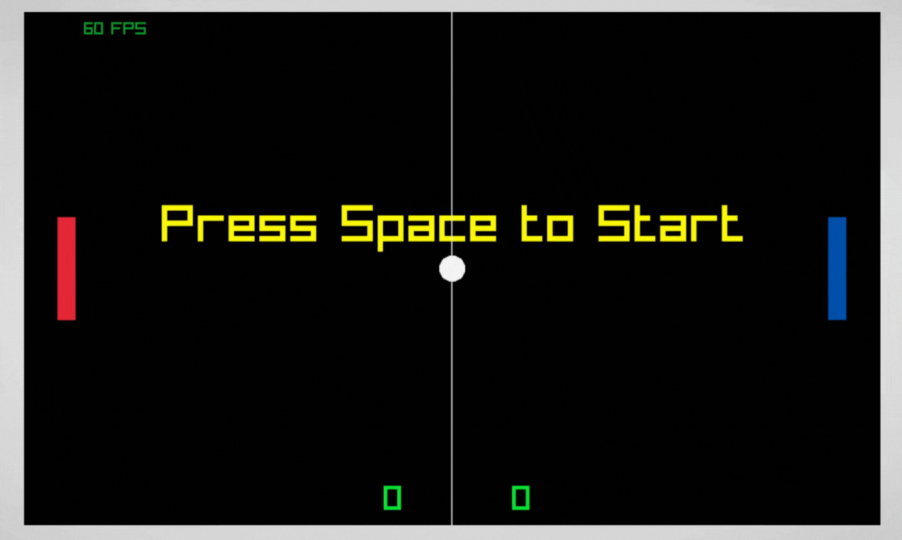
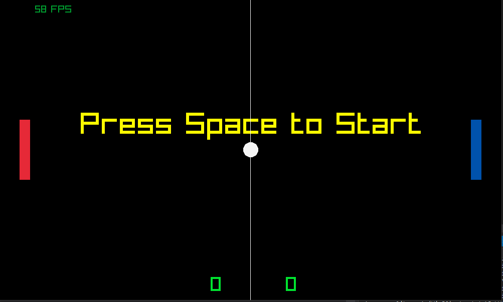
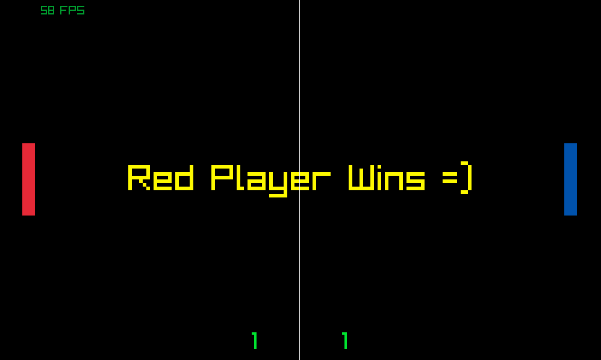
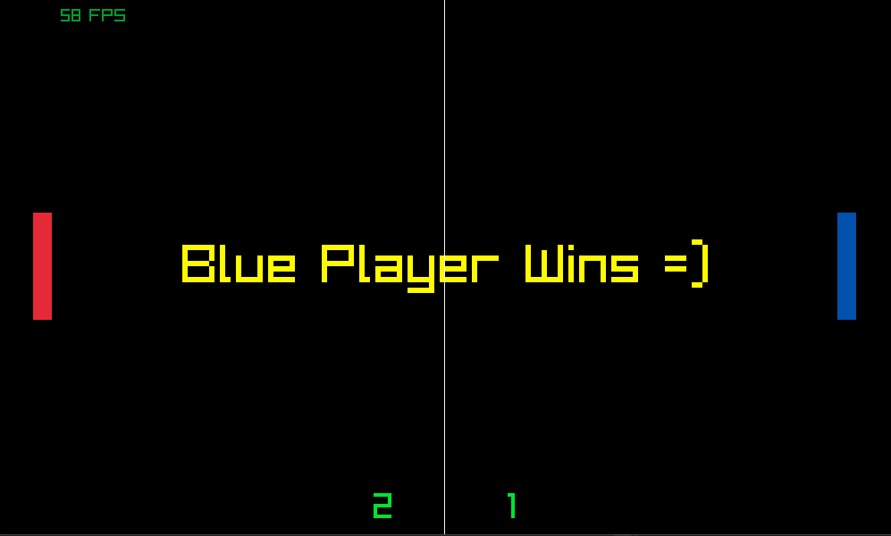

# pong

## Description.

This is my first game finished with [Raylib](https://www.raylib.com/) library and *C++* language, is cool when you can finish a project, even small project like this. begin is easy but finishe is other thing.

My game has one main windows, *Board*.



## Building The Game:
- You need to have raylib installed on your system


### Installing and building raylib via vcpkg
```
  git clone https://github.com/Microsoft/vcpkg.git
  cd vcpkg
  bootstrap-vcpkg.bat
  vcpkg integrate install
  vcpkg install raylib
```


### Or

- Follow https://github.com/raysan5/raylib/wiki/Working-on-Windows to setup the build system using Visual Studio

## Get Source and Build

```
git clone https://github.com/AliElsheeikh/pong.git
```


## Controls

|                 | Left Player                                       | Right Player |
|-----------------|---------------------------------------------------|----------|
| **Move**        | <kbd>W</kbd> <kbd>S</kbd>                         | <kbd>&#8593;</kbd><kbd>&#8595;</kbd> |
| **Start**       | <kbd>Backspace </kbd>                                 |  |
| **Exit**       | <kbd>ESC </kbd>                                 |  |

## Screenshots








